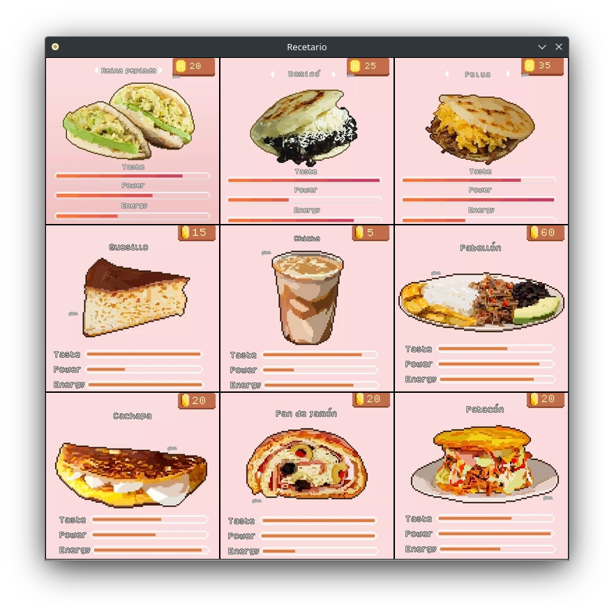
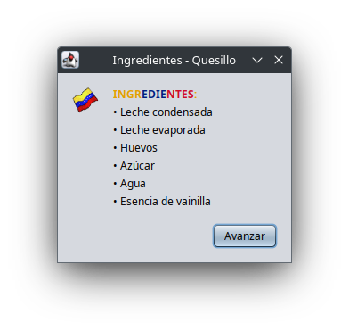
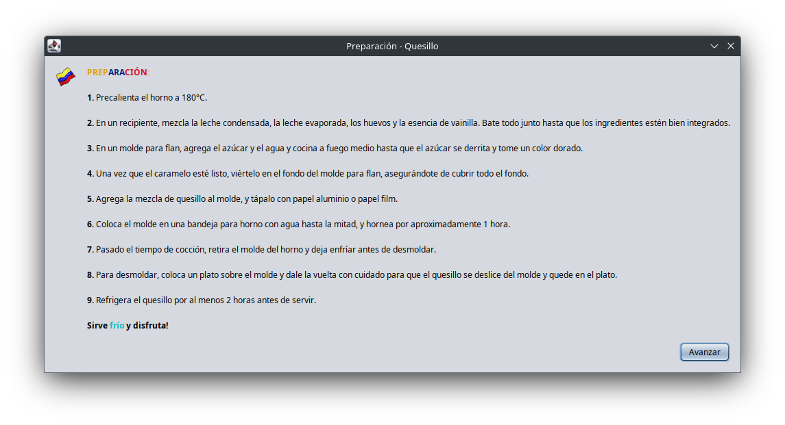

# ProyectoP2
Proyecto final para el tercer corte de la asignatura *Programación II*

Presentado a los 31 días del mes de marzo de 2023, en la ciudad de Maracaibo, Estado Zulia.

### IMPORTANTE
Los pixel arts de los platos típicos venezolanos **NO** me pertenecen, todos los créditos a su respectiva autora [SailorGlitch](https://www.instagram.com/sailorglitch).

## Menú Principal

## Ingredientes

## Preparación

